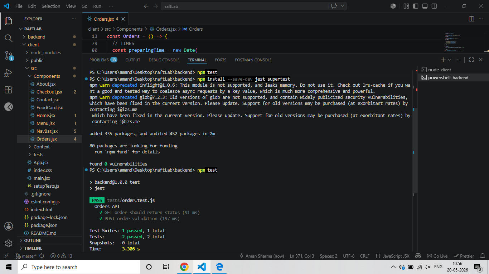
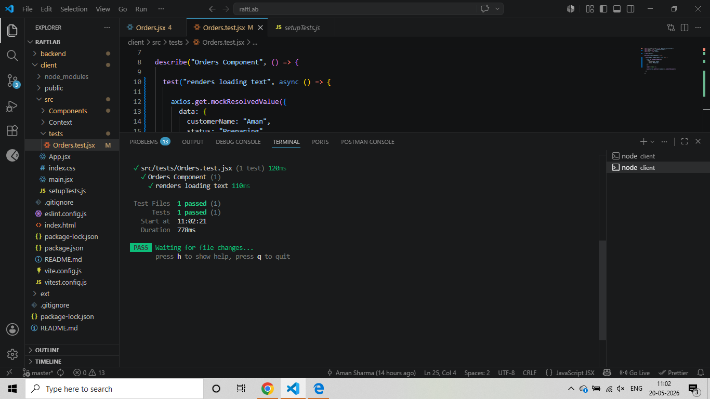

# RaftLab Food Ordering System

A full-stack food ordering and order tracking application built using React.js, Node.js, Express.js and MongoDB.

The application allows users to browse food items, manage cart operations, place orders and track order status dynamically in real time.

---

# Tech Stack

## Frontend
- React.js
- Vite
- Tailwind CSS
- Axios
- React Router DOM

## Backend
- Node.js
- Express.js
- MongoDB
- Mongoose

## Testing
- Jest
- Supertest
- Vitest
- React Testing Library

---

# Features

- Browse food menu
- Add/remove cart items
- Dynamic cart management
- Checkout functionality
- Place orders
- Order tracking system
- Simulated real-time order status updates
- Responsive UI
- API integration
- Form validation
- Backend API testing
- Frontend component testing
 
---

# Order Tracking System

Implemented a simulated real-time order tracking system where order statuses automatically update step-by-step:

- Order Received
- Preparing
- Out For Delivery
- Delivered

The UI dynamically updates the active order stage and timestamps to create a real-time delivery tracking experience for users.

---

# Project Structure

```bash
raftlab/
│
├── client/
│
├── backend/
│
└── README.md
```

---

# Installation

## Clone Repository

```bash
git clone https://github.com/Aman2907/raftlab.git
```

---

# Backend Setup

```bash
cd backend
npm install
npm run dev
```

Backend server runs on:

```bash
http://localhost:5000
```

---

# Frontend Setup

```bash
cd client
npm install
npm run dev
```

Frontend runs on:

```bash
http://localhost:5173
```

---

# Testing

## Backend Tests

Run backend tests:

```bash
cd backend
npm test
```

Covered backend test cases:

- GET Orders API
- POST Order API validation
- CRUD operation testing
- Input validation testing
- Order status update testing

---

## Frontend Tests

Run frontend tests:

```bash
cd client
npm run test
```

Covered frontend test cases:

- React component rendering tests
- Loading state rendering
- UI component validation
- Order tracking component testing

---

# TDD Implementation

The project follows Test-Driven Development (TDD) principles.

Implemented automated testing for:

- API endpoint testing
- CRUD operation testing
- Input validation testing
- Order status update testing
- React component rendering tests

---

# Test Results

## Backend Test Results



---

## Frontend Test Results



---

# Screenshots Folder Structure

```bash
screenshots/
├── backend-tests.png
└── frontend-tests.png
```

---

# Future Improvements

- Payment gateway integration
- Authentication & authorization
- Admin dashboard
- Real-time socket updates
- Deployment using Docker & CI/CD

---

# Author

Aman Sharma
